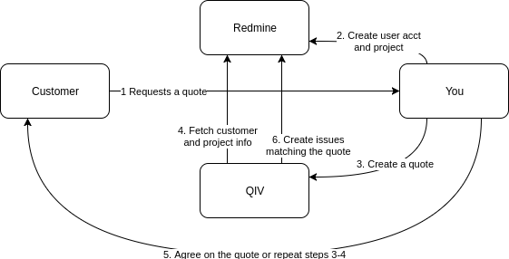
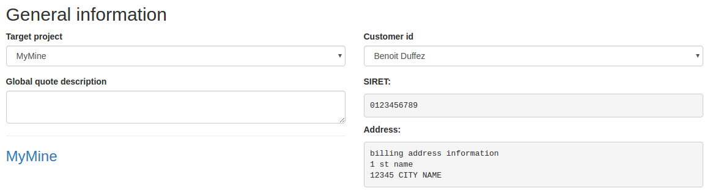
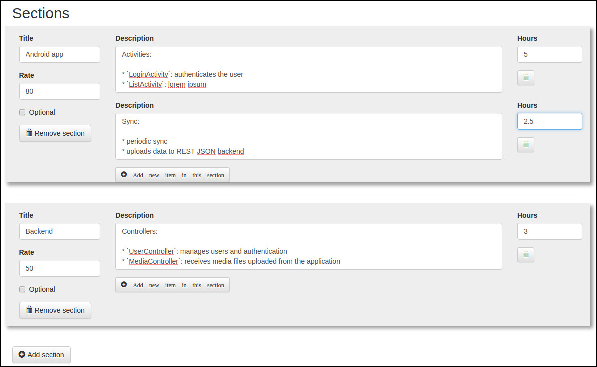
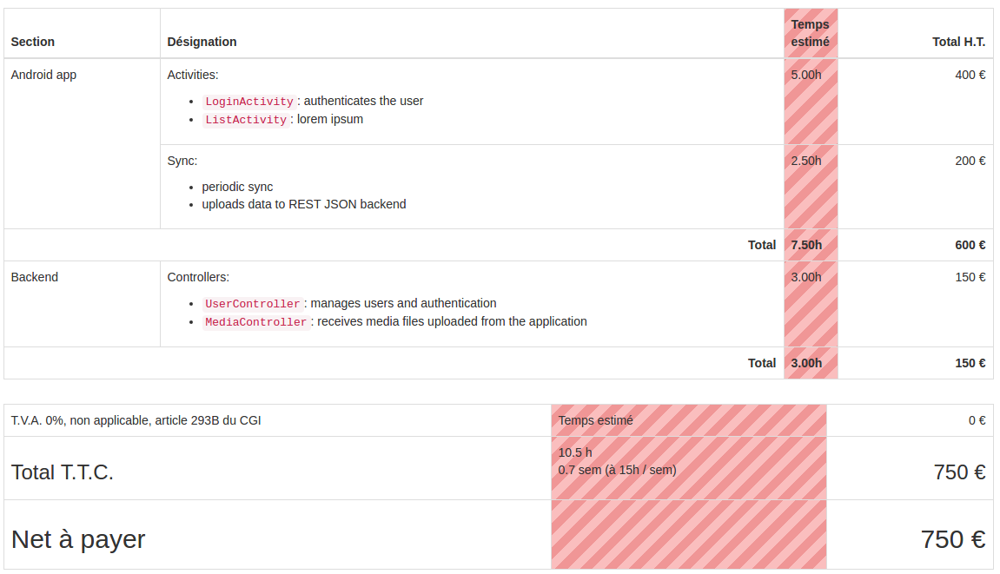
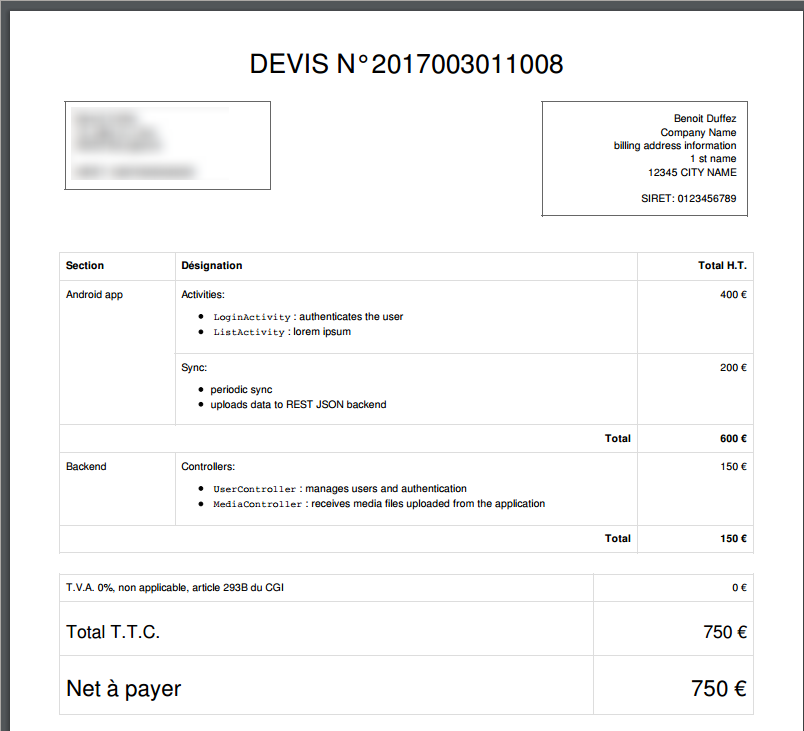

# RedmineQuoteInvoice
Quote/Invoice Symfony project

The quote workflow is simple:

1. The customer requests for a quote
1. You create a project and a user on Redmine for the customer; add the new user to the project
1. You create a quote on the web tool:
   1. Select target project
   1. Select target customer
   1. Add sections and items for your quote
1. The QIV tool will fetch the project and customer information (including custom fields like company identification number, billing address, etc.)
1. You export the quote to PDF and negociate with the customer  
If there is no agreement, you need to repeat steps 3-4. The best way to do so is to duplicate the quote created in step 4 to start with a new one. The old one is kept intact and the new one is created with a new quote number.
1. Once you have reached an agreement with the customer, the QIV tool is able to create one issue per quote item on Redmine so that you can work.

## Examples

Step 3, i and ii: select project and customer that will be linked to the quote:

Step 3, iii: add sections and items to your quote. The sections will be exported as issue categories on Redmine. Each item will be exported as an issue on Redmine.  
You can apply a different rate (say 80€/hour) on each section. On each item, you set how many hours you will charge.  
Each item description text will be parsed using the *Markdown* syntax, so you can have lists, text decoration, etc.

Step 4: the quote is created. It shows the estimated time in a red column, this column will be hidden on the PDF.

Step 5: the quote is exported to PDF, ready to be sent to the customer:

# Installation

1. Create a user 'qiv' (or anything) on Redmine and enable its API key
1. Create a the custom fields on Redmine users table for some advanced user information (company name, identification, address, etc)
1. `git clone <repo>`
1. `cd <folder>`
1. `composer install`
1. Fill redmine and Symfony parameters (including the API key retrieved in step 1)
1. `php bin/console doctrine:schema:update --force`

Go to `/user/register` and create an admin account

# Project

Highly in WIP. Not useable by anyone but me atm. I'm planning to make this easier to use for other freelancers should they show interest for this project.

I initially intended to create this project as a Redmine plugin that would be tightly integrated into Redmine, but I can't stand rails.

